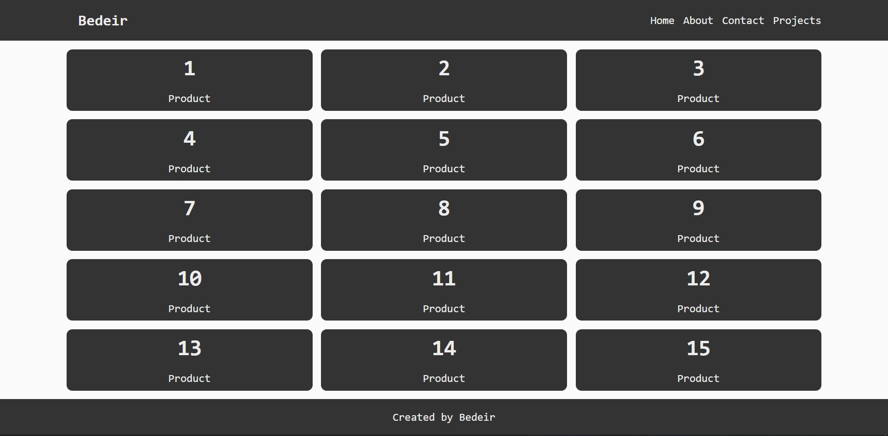

# Javascript Tasks

---

# 1- [DOM Challenge](https://www.youtube.com/watch?v=mGhGjzIKEqk)

Description

Use javascript only to design a webpage such that it has a header, footer and body. The body contains 15 card space-separated evenly 5x3|height and width respectively.

# 2- [BOM Challenge](https://www.youtube.com/watch?v=LzKt8GaoFMs)

Description
Make a to-do app add an option to delete the task and save it in Local Storage.

